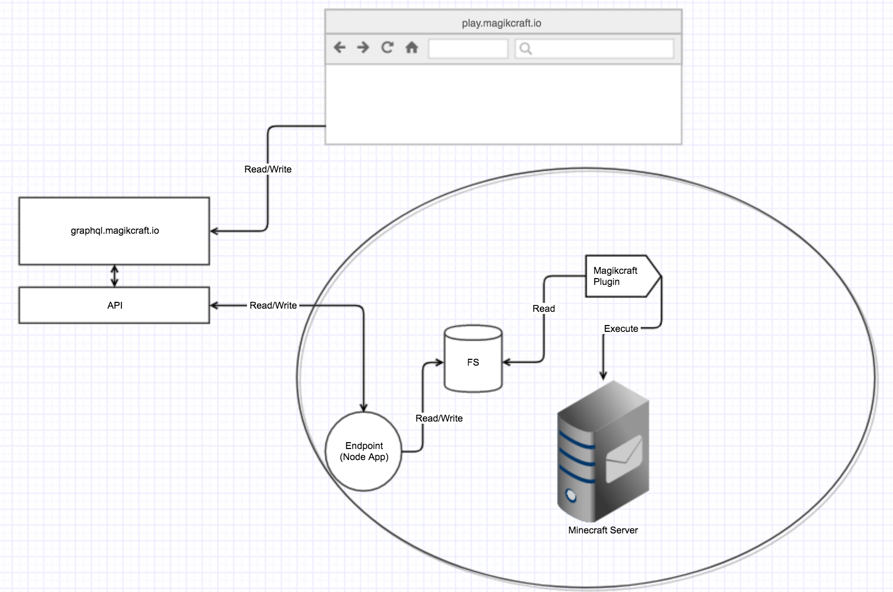

# How does data flow in Magikcraft

The code is structured in a way that it can be run in a Node.js environment for unit testing, a Magikcraft/Minecraft environment for deployment, and a web browser environment for a web app (see [app.mct1.io](http://app.mct1.io)).

The [`src/util`](https://github.com/mc-t1/mct1/tree/master/src/util) folder contains wrapper functions that detect the environment and return the appropriate implementation.
